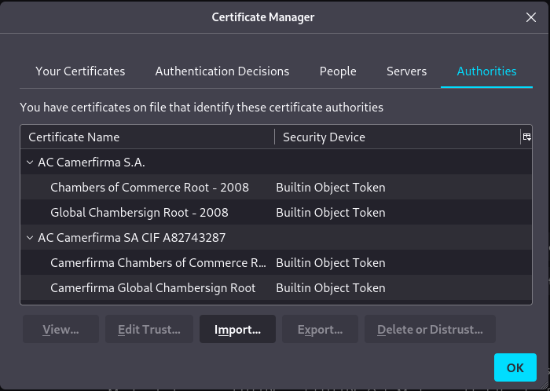
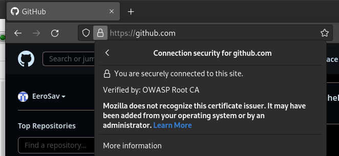
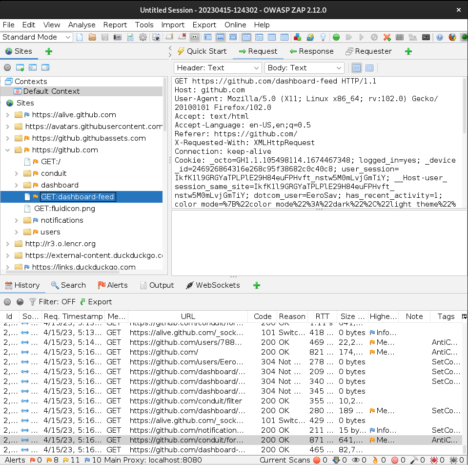
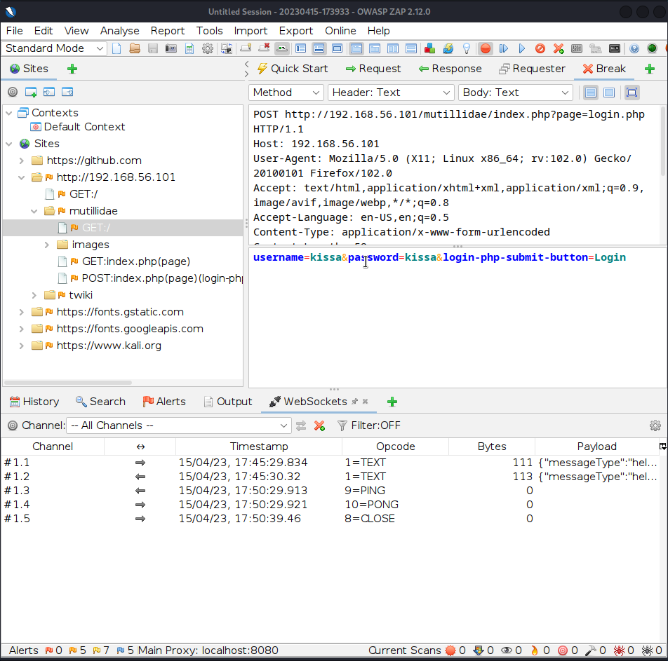

# h2 Totally Legit Sertificate

##x) Lue ja tiivistä. (Tässä x-alakohdassa ei tarvitse tehdä testejä tietokoneella, vain lukeminen tai kuunteleminen ja tiivistelmä riittää. Tiivistämiseen riittää muutama ranskalainen viiva.)

[PortSwigger: SQL injection](https://portswigger.net/web-security/sql-injection)

- Manipulating SQL query to access unauthorized data 

[PortSwigger: Cross-site scripting](https://portswigger.net/web-security/cross-site-scripting)

- Malicious script that in some way gets injected into web page.

- Cross-site scripting vulnerabilities normally allow an attacker to masquerade as a victim user, to carry out any actions that the user is able to perform, and to access any of the user's data

- Reflected XSS, where the malicious script comes from the current HTTP request.

- Stored XSS, where the malicious script comes from the website's database.

- DOM-based XSS, where the vulnerability exists in client-side code rather than server-side code.

   
## a) ZAP! Asenna ZAP välimiesproxy ja näytä, että pystyt sieppaamaan liikennettä selaimesta.

installed zap1.12.0 (cross platform package) from the official site, https://www.zaproxy.org/download/

extracted the zip file and ran the zap.sh file:

		./zap.sh 
	./zap.sh: line 50: [: -ge: unary operator expected
	Exiting: ZAP requires a minimum of Java 11 to run, found 

installed java

	sudo apt install default-jre
	java -version
	openjdk version "11.0.18" 2023-01-17

zap is now running.

open and setup firefox with zap from the upper right corner.

i went to owasp website to do research for the next task. searched CA from the sites own search and it looked like this from zap perspective.

## b) Totally Legit Sertificate. Asenna ZAP:n generoima CA-sertifikaatti selaimeen ja osoita testillä, että pystyt sieppaamaan HTTPS-salakirjoitettua liikennettä.

Zap -> Tools -> Options -> Network:

	Server Certificates
	Generate, Save

Firefox -> Settings -> Privacy & Security -> Certificates -> View Certificates

Import and choose the previously generated certificate

firefox [foxyproxy](https://addons.mozilla.org/en-US/firefox/addon/foxyproxy-standard/) proxy asetusten muuttamiseen nopeammin kuin firefoxin asetuksista.

foxyproxy ip 127.0.0.1 ja portti zap network asetuksissa määritelty 8080

## c) Intercept. Pysäytä hakupyyntö, muokkaa sitä ja päästä se palvelimelle.

for this task i used mutillidae target site that came with metasploitable2

checked zap button for intercepting all requests and when i tried to log into the site i got the username and password.

changed username and password to msfadmin and tried sent the request. nothing happened but from zap history i saw that the packet got sent.

## d) Vuohi. Asenna WebGoat ja kokeile, että pääset kirjautumaan sisään.

installed following this guide: https://terokarvinen.com/2020/install-webgoat-web-pentest-practice-target/

		sudo apt-get update
		sudo apt-get -y install openjdk-11-jre ufw wget bash-completion

		wget https://terokarvinen.com/2020/install-webgoat-web-pentest-practice-target/webgoat-server-8.0.0.M26.jar

		java -jar webgoat-server-8.0.0.M26.jar

got error message saying port 8080 was already in use so changed the port to 8000 with `export WEBGOAT_PORT=8000`

## e) Vauvavuohi. Ratkaise WebGoatista tehtävät "HTTP Basics" ja "Developer tools". Katso vinkit alta.

## f) SELECT * FROM student. Ratkaise SQLZoo:sta: 0 SELECT basics, 2 SELECT from World kohdat 1-5.

SELECT basics 1-3:

		SELECT population FROM world
		  WHERE name = 'Germany'

		SELECT name, population FROM world
		   WHERE name IN ('Sweden', 'Norway', 'Denmark');

		SELECT name, area FROM world
		   WHERE area BETWEEN 200000 AND 250000 

SELECT from WORLD 1-:

table contents: name	continent	area 	population	gdp		

		1.
		SELECT name, continent, population FROM world

		2.
		SELECT name FROM world
		WHERE population >= 200000000

		3.
		SELECT name, gdp/population FROM world
		WHERE population >= 200000000

		4.
		SELECT name, population/10000000 FROM world
		WHERE continent = 'South America'

		5.
		SELECT name, population FROM world
		WHERE name IN ('France' , 'Germany' , 'Italy')

		6.
sources: https://owasp.org/www-project-webgoat/
