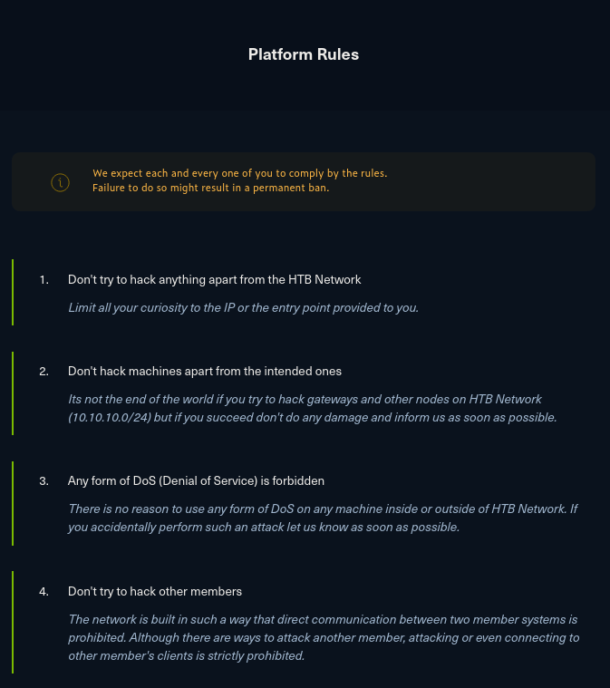
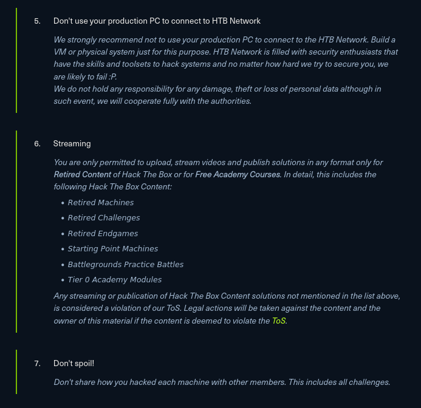
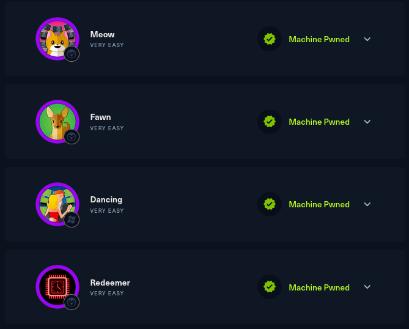

# h3 The Box

## x)

[HackTheBox-Shoppy](https://www.youtube.com/watch?v=AJc53DUdt1M)

aloitus `sudo nmmap -sC -sV -oA nmap/shoppy 10.10.11.180`

nmap:
	-sC
	-sV
	-oA

	
`less nmap/shoppy.nmap`

portit 22 ja 80 auki

## a) We like to shop. 

### Ratkaise Portswigger Academyn Lab: SQL injection vulnerability in WHERE clause allowing retrieval of hidden data". (Tee tarvittaessa tunnus Portswigger Academyyn).

kirjaitin sql injektion suoraan hakukenttään, ensin tutkin miltä näyttää yhden kategorian: 

https://0a2d000503a3337c80ee9e8300d900fe.web-security-academy.net/filter?category=Pets

kategoria määritellään suoraan lopussa, kokeilin määritellä sql injektion muotoon kategoria pets tai true, eli kunhan tuotteelle on määritelty kategoria se näytetään, hetken kikkailtuani virheellisen lausemuodon kanssa sain pyynnön toimimaan ja tehtävä ratkesi sillä.

`filter?category=Pets'+OR+1=1 --`

https://0a2d000503a3337c80ee9e8300d900fe.web-security-academy.net/filter?category=Pets%27+OR+1=1%20--

## b) HTB. Tee HackTheBox.com tunnus. Avaa OpenVPN-yhteys "Starting Point" verkkoon. Estä tunnelin ulkopuolinen liikenne eli liikenne oikeaan Internettiin (vinkit alla). Testaa, että normaali Internet-liikenteesi on estetty.

säännöt:

tein tunnuksen hacktheboxiin. asensin openvpn asetustiedoston

avasin network connections asetukset komennolla `nm_connection_editor`

valitsin sieltä import a saved VPN configuration ja valitsin lataamani asetustiedoston, en tehnyt mitään muutoksia vaan painoin suoraan save.

menin osoitteeseen https://app.hackthebox.com/starting-point ja valitsin sieltä meow maalikoneen.

valitsin kalin internet asetuksista vpn yhteyden. mitään ei tapahtunut vaikka vpn oli selvästi päällä. testasin samalla yhteyden muihin palvelimiin, joista ei tullut vastausta.

asensin uuden vpn asetustiedoston tällä kertaa määrittelin alueeksi euroopan

otin vpn yhteyden hetkeksi pois päältä jolloin spawn machine nappi muuttui vihreäksi. se kuitenkin vaihtui takasin harmaaksi hetken päästä.

vaihdoin tcp malliseen asetustiedostoon jolloin yhteys rupisi toimimaan. 

kokeilin käynnistää vpn yhteyden komentoriviltä komennolla `sudo openvpn starting_point_eeros\(2\).ovpn `

kaikki näytti samalta kuin aiemmin, mutta tällä kertaa kone käynnistyi

vaihdoin työskentelyn toiselle tietokoneelleni ja tällä kertaa hostasin maalikonetta pääkäyttöjärjestelmällä ja yhdistin siihen kali virtuaalikoneella johon asensin hacktheboxin vpn

## c) Meow. Käynnistä "Starting point": "Meow". (Spawn machine). Tallenna ruutukaappaus sivusta, jossa näkyy koneen osoite ja tunkeutumistehtäviä. Porttiskannaa kone ja analysoi tulokset. Suorita HTB:n antamat tehtävät. Raportoi normaalisti, "Starting point" -koneista saa julkaista läpikävelyohjeita.

skannasin maalikoneen ip osoitteen nmapilla: `nmap -sV -sC -oA nmap 10.129.192.45`

koneessa oli portti23 auki käyttäen telnettiä.

yhdistin koneeseen telnetillä

`telnet 10.129.192.45`

sain auki kirjautumisikkunan johon annoin käyttäjäksi root ja pääsin sisään ilman salasanaa.

tarkkailin hakemistoa komennolla ls ja avasin flag.txt nimisen tekstitiedoston cat komennolla josta löysin tehtävän vastauksen.

## d) Fawn. Ratkaise Fawn. (HTB Starting point)

skannasin kohdekoneen nmapilla,

		Starting Nmap 7.93 ( https://nmap.org ) at 2023-04-28 09:34 EDT
		Nmap scan report for 10.129.146.179
		Host is up (0.034s latency).
		Not shown: 999 closed tcp ports (reset)
		PORT   STATE SERVICE VERSION
		21/tcp open  ftp     vsftpd 3.0.3
		| ftp-syst: 
		|   STAT: 
		| FTP server status:
		|      Connected to ::ffff:10.10.14.175
		|      Logged in as ftp
		|      TYPE: ASCII
		|      No session bandwidth limit
		|      Session timeout in seconds is 300
		|      Control connection is plain text
		|      Data connections will be plain text
		|      At session startup, client count was 1
		|      vsFTPd 3.0.3 - secure, fast, stable
		|_End of status
		| ftp-anon: Anonymous FTP login allowed (FTP code 230)
		|_-rw-r--r--    1 0        0              32 Jun 04  2021 flag.txt
		Service Info: OS: Unix
		
		Service detection performed. Please report any incorrect results at https://nmap.org/submit/ .
		Nmap done: 1 IP address (1 host up) scanned in 36.69 seconds

portti 21 auki jossa ftp palvelin.

yhdistin ftp palvelimeen komennolla `ftp 10.129.146.179`

login nimeksi laitoin anonymous ja en tarvinnut salasanaa päästäkseni sisään.		

hyödynsin ftp:n get komentoa jolla latasin flag.txt tiedoston palvelimelta ja sain sen avattua omalla koneellani.

## e) Dancing. Ratkaise Dancing. (HTB Starting point)

skannasin nmapilla:

		Starting Nmap 7.93 ( https://nmap.org ) at 2023-04-28 09:42 EDT
		Nmap scan report for 10.129.143.203
		Host is up (0.034s latency).
		Not shown: 997 closed tcp ports (reset)
		PORT    STATE SERVICE       VERSION
		135/tcp open  msrpc         Microsoft Windows RPC
		139/tcp open  netbios-ssn   Microsoft Windows netbios-ssn
		445/tcp open  microsoft-ds?
		Service Info: OS: Windows; CPE: cpe:/o:microsoft:windows
		
		Host script results:
		| smb2-security-mode: 
		|   311: 
		|_    Message signing enabled but not required
		| smb2-time: 
		|   date: 2023-04-28T17:46:13
		|_  start_date: N/A
		|_clock-skew: 4h03m03s
		
		Service detection performed. Please report any incorrect results at https://nmap.org/submit/ .
		Nmap done: 1 IP address (1 host up) scanned in 31.19 seconds
		                                                                  
kohdekone windows mallia. server message block palvelin

hyödynsin smbclienttia ja sain sen listaamaan tiedostot

		smbclient -L 10.129.143.203
		
		Password for [WORKGROUP\root]:
		
		        Sharename       Type      Comment
		        ---------       ----      -------
		        ADMIN$          Disk      Remote Admin
		        C$              Disk      Default share
		        IPC$            IPC       Remote IPC
		        WorkShares      Disk      
		Reconnecting with SMB1 for workgroup listing.
		do_connect: Connection to 10.129.143.203 failed (Error NT_STATUS_RESOURCE_NAME_NOT_FOUND)
		Unable to connect with SMB1 -- no workgroup available
		
workshares hakemistoon pääsi käsiksi ilman salasanaa komennolla `smbclient \\\\10.129.143.203\\WorkShares`

poistuin smbclientista ja tallennetuista tiedostoista löytyi flagi.

