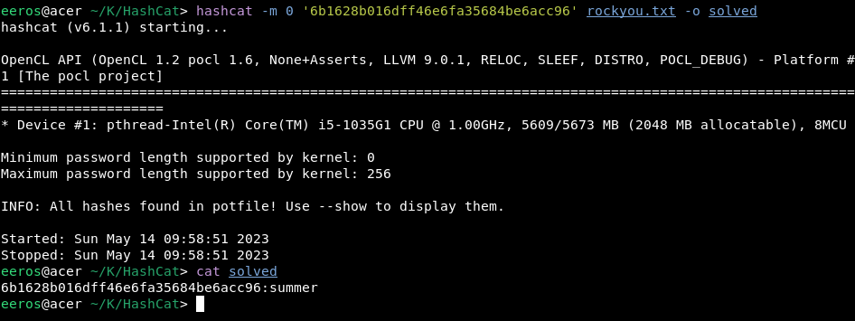

## x) 

### [Cracking Passwords with Hashcat](https://terokarvinen.com/2022/cracking-passwords-with-hashcat/)

## Hashcat
- Salasanat tallennetaan hasheina, hashit ovat yksisuuntaisia eli niitä ei voi kääntää takaisin salasanaksi. 
- Salasanan selvittämiseksi pitää kääntää salasanaveikkauksia hashiksi ja verrata sitä saatuun hashiin.
-  asennetaan hashcat ja tehdään sille hakemisto, asennetaan mallisalasanakirjasto esim rockyou
- Selvitetään millä tekniikalla hash on tehty `hashid -m (hash)`

Hashcat -m (hashid) (hash) -o solved
Tallentaa vastauksen

### [Crack File Password With John](https://terokarvinen.com/2023/crack-file-password-with-john/)

- työkalu salasanasuojattujen tiedostojen murtamista varten

- artikkelissa hyödynnetyt ohjelmat:   
		micro	Text editor
		bash-completion	Use tab to complete file names
		git	Clone (copy) Jumbo John source code
		build-essential	C compiler and related tools
		libssl-dev	John requirements
		zlib1g zlib1g-dev zlib1g-gst	For John ZIP support
		libbz2-1.0 libbz2-dev	For John 7zip support
		atool zip	Compression tools, 'aunpack foo.zip', 'unzip foo.zip'
		wget	Web downloader for command line

		
`sudo apt-get -y install micro bash-completion git build-essential libssl-dev zlib1g zlib1g-dev zlib-gst libbz2-1.0 libbz2-dev atool zip wget`		

- asennus kloonaamalla gitistä, --depth=1 määrittelee että ladataan vain uusin versio -> nopeampi lataus

`git clone --depth=1 https://github.com/openwall/john.git`

- asennus: `cd john/src`  `./configure` 

- asennus loppuun make komennolla `./configure` jälkeen.

- ajettavat skriptit /run/ hakemistossa

- asennuksen testaus /run/john

### [Find Hidden Web Directories - Fuzz URLs with ffuf](https://terokarvinen.com/2023/fuzz-urls-find-hidden-directories/)

- työkalu nettisivuhakemistojen löytämiseen joita ei ole linkattu mihinkään.

- asennus wget githubista

`wget https://github.com/ffuf/ffuf/releases/download/v2.0.0/ffuf_2.0.0_linux_amd64.tar.gz`

- asennuksen purku ja ffuf ajo

		$ tar -xf ffuf_2.0.0_linux_amd64.tar.gz
		$ ./ffuf
		Fuzz Faster U Fool - v2.0.0

- tarvitsee hakemistokirjaston toimiakseen. esim danielmiesslerin github SecListoista

`wget https://raw.githubusercontent.com/danielmiessler/SecLists/master/Discovery/Web-Content/common.txt`

- kone irti internetistä jos ei tiedä tarkasti mitä tekee.

- kaikki ffuf parametrit saa: `./fuff`

- putkitettuna less: `./ffuf |& less`

- käyttö esim: -w wordlist, -u osoite johon listaa verrataan, FUZZ kohdalle kokeillaan osoitekirjastoa

` ./ffuf -w common.txt -u http://127.0.0.2:8000/FUZZ`

- ei haluttujen tulosten filtteröinti

## a)

koska olin jo asentanut wgetin asensin hashcatin ja hashid:n komennolla `sudo apt-get install hashid hashcat`

tein uuden hakemiston nimeltä HashCat

selvitin esimerkkihasin tyypin komennolla `hashid -m 6b1628b016dff46e6fa35684be6acc96`

sen jälkeen kokeilin ratkaista sen md5 hashina

## b)

latasin dirfuzt-1 ohjesivulta, navigoin latauskansioon annoin suoritusoikeudet `chmod u+x dirfuzt-1` ja ajoin sen `./dirfuzt-1` testasin avaamalla nettisivun.

asensin ffuf `wget https://github.com/ffuf/ffuf/releases/download/v2.0.0/ffuf_2.0.0_linux_amd64.tar.gz`

purin tar paketin `tar -xf ffuf_2.0.0_linux_amd64.tar.gz`

putkitus lessiin argumentit olivat toisinpäin shellistä johtuen.

		eeros@acer ~/K/T/ffuf [1]> ./ffuf |& less
		fish: |& is not valid. In fish, use &| to pipe both stdout and stderr.
		./ffuf |& less
		       ^^
		eeros@acer ~/K/T/ffuf [1]> ./ffuf &| less
		
common.txt sanakirja asennus wgetillä `wet https://raw.githubusercontent.com/danielmiessler/SecLists/master/Discovery/Web-Content/common.txt`

`./ffuf -w common.txt -u http://127.0.0.2:8000/FUZZ`

paljon samanlaisia tuloksia.

kokeilin -fs filtteriä jolla filtteröin pois kaikki tulokset jotka ovat kokoa 154: `  -fs	Filter HTTP response size. Comma separated list of sizes and ranges`

versionhallintaan liittyvät sivut .git alkuisia ja admin wp-admin.

## c)

## d)

tein sanakirjan kopioimalla tekstin ja lisäämällä rivinvaihdot jokaisen välilyönnin kohdalle komennolla `tr " " "\n" < jurpo.txt `

ajoin hashcatin vertaamalla jurpo.txt sanoja: `hashcat -m 1000 '83f1cf89225005caeb4e52c9ea9b00e0' /home/eeros/Koulu/TunkeutumisTestaus/JurpoSanakirja/jurpo.txt -o solved`

	Dictionary cache built:
	* Filename..: /home/eeros/Koulu/TunkeutumisTestaus/JurpoSanakirja/jurpo.txt
	* Passwords.: 34
	* Bytes.....: 304
	* Keyspace..: 34
	* Runtime...: 0 secs
	
	The wordlist or mask that you are using is too small.
	This means that hashcat cannot use the full parallel power of your device(s).
	Unless you supply more work, your cracking speed will drop.
	For tips on supplying more work, see: https://hashcat.net/faq/morework
	
	Approaching final keyspace - workload adjusted.  
	
	                                                 
	Session..........: hashcat
	Status...........: Cracked
	Hash.Name........: NTLM
	Hash.Target......: 83f1cf89225005caeb4e52c9ea9b00e0
	Time.Started.....: Mon May 15 08:05:18 2023 (0 secs)
	Time.Estimated...: Mon May 15 08:05:18 2023 (0 secs)
	Guess.Base.......: File (/home/eeros/Koulu/TunkeutumisTestaus/JurpoSanakirja/jurpo.txt)
	Guess.Queue......: 1/1 (100.00%)
	Speed.#1.........:   138.0 kH/s (0.02ms) @ Accel:1024 Loops:1 Thr:1 Vec:16
	Recovered........: 1/1 (100.00%) Digests
	Progress.........: 34/34 (100.00%)
	Rejected.........: 0/34 (0.00%)
	Restore.Point....: 0/34 (0.00%)
	Restore.Sub.#1...: Salt:0 Amplifier:0-1 Iteration:0-1
	Candidates.#1....: Jurpon -> TORissa.
	
	Started: Mon May 15 08:05:17 2023
	Stopped: Mon May 15 08:05:20 2023
	eeros@acer ~/K/HashCat> cat solved
	83f1cf89225005caeb4e52c9ea9b00e0:MasterLazerMan
	

